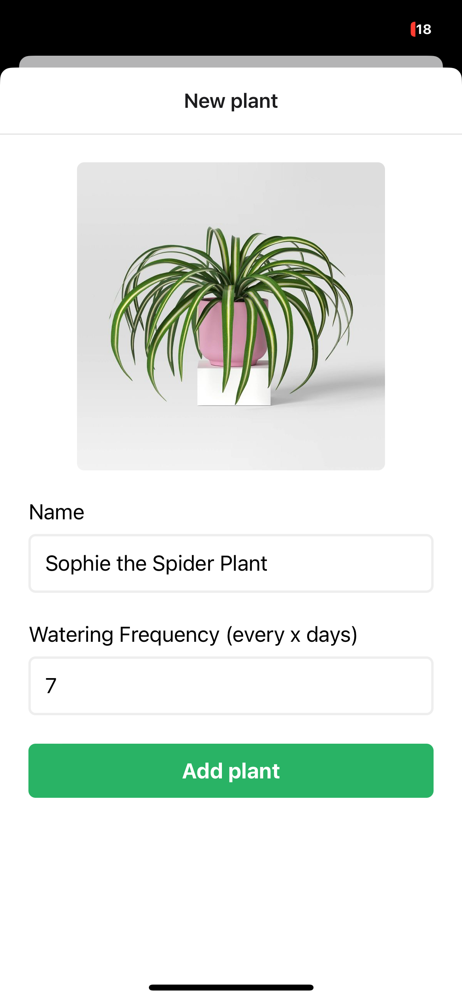

# 🌱 Plantly - Keep Your Plants Happy and Hydrated

Plantly is a delightful mobile application designed to help plant enthusiasts keep track of their plants' watering schedules. With its cute and user-friendly interface, Plantly makes plant care a joyful experience.

## ✨ Features

- 🪴 Add and manage multiple plants with custom names
- ⏰ Set individual watering schedules for each plant
- 💧 Track last watering dates and upcoming watering needs
- 🎨 Beautiful, minimalist UI with adorable plant illustrations
- 📱 Built with React Native and Expo for iOS and Android

## 📱 App Screenshots

Here's a visual tour of Plantly's beautiful interface:

### Welcome Screen and Home

<div style="display: flex; gap: 10px;">
  
  
</div>

### Plant Management

<div style="display: flex; gap: 10px;">
  
  
</div>

### Plant Details and Watering

<div style="display: flex; gap: 10px;">
  
  
</div>

## 🚀 Getting Started

### Prerequisites

- Node.js (v14 or higher)
- Yarn or npm
- Expo CLI
- iOS Simulator (for Mac users) or Android Studio (for Android development)

### Installation

1. Clone the repository:

```bash
git clone https://github.com/yourusername/plantly.git
cd plantly
```

2. Install dependencies:

```bash
yarn install
# or
npm install
```

3. Start the development server:

```bash
yarn start
# or
npm start
```

4. Run on your preferred platform:

- Press `i` to run on iOS simulator
- Press `a` to run on Android emulator
- Scan the QR code with Expo Go app on your physical device

## 🛠️ Built With

- [React Native](https://reactnative.dev/) - The mobile framework
- [Expo](https://expo.dev/) - Development platform
- [TypeScript](https://www.typescriptlang.org/) - Programming language
- [React Navigation](https://reactnavigation.org/) - Navigation library
- [Async Storage](https://react-native-async-storage.github.io/async-storage/) - Data persistence

## 📱 App Structure

```
plantly/
├── app/                 # App screens and navigation
├── components/          # Reusable components
├── assets/             # Images and fonts
├── store/              # State management
└── theme.ts            # App theming and styling
```

## 🌟 Features in Detail

### Plant Management

- Add new plants with custom names
- Set watering frequency (in days)
- View all plants in a clean, card-based layout

### Watering Tracking

- Track last watering date for each plant
- Get notifications when plants need watering
- Mark plants as watered with a simple tap

### User Interface

- Clean, modern design
- Intuitive navigation
- Adorable plant illustrations
- Responsive layout for all screen sizes

## 📝 License

This project is licensed under the MIT License - see the [LICENSE](LICENSE) file for details.

## 🤝 Contributing

Contributions are welcome! Feel free to submit a Pull Request.

## 💖 Acknowledgments

- Plant illustrations inspired by kawaii design
- Built with love for plant enthusiasts

---

Made with 🌱 by [Your Name]
